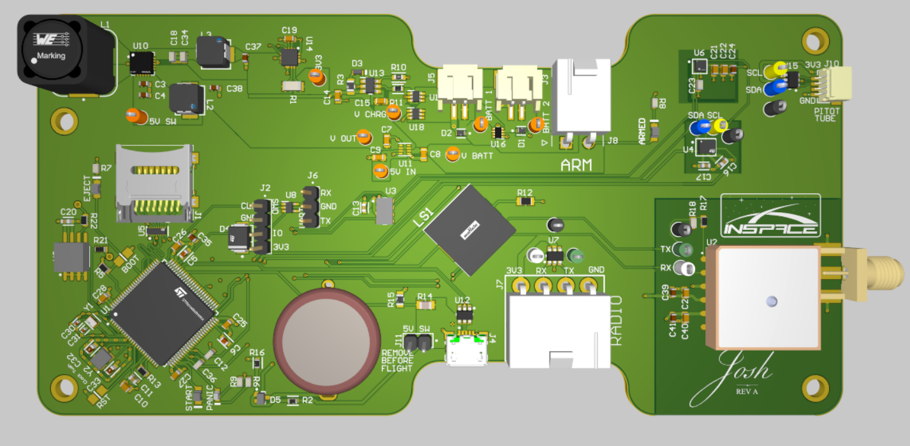

# Josh Flight Computer

This repository contains the board support logic to run [Apache NuttX][nuttx] on the Josh flight computer.

The flight computer MCU is the STM32H743.

This board support package is intended to built as an out-of-tree custom board in the NuttX build process.

[nuttx]: https://github.com/apache/nuttx

this is a test change for the mono autoupdate
